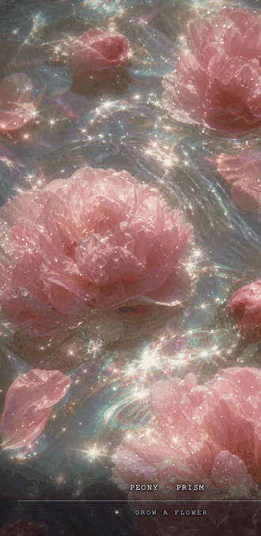

# 镜花水月

*Flowers in a mirror, moon in water.* An interactive artwork by [Wanli](https://wanlivisuals.com).

**Play:** https://melloww-w.github.io/liquid-garden/

  

## How to play

**Make waves.** Move your cursor across the water; on a phone, drag or tap.
The ripples bend the flowers, and the glitter drifts with the current.

**Wander the garden.** Open the flower menu at the bottom to choose a bloom,
or press **space** (double-tap on a phone) to drift to a random one.

**Grow your own.** Type any real flower's name into *grow a flower* and press
enter. The garden takes about forty seconds to grow it, and the water fills
with light while you wait. Each visitor may grow one new flower a day; a
flower someone has already grown appears instantly.

Every flower is grown in its own weather: fog, aurora, gold, mirror, frost,
smoke, and more, chosen by the flower's name. The same name always returns
to the same weather.

**Keep it.** Flowers you grow stay in your menu on your device. The artist
tends the shared garden and plants the loveliest ones for everyone.

**Take it with you.** On a phone, *Add to Home Screen* installs 镜花水月 as a
full-screen app. Share a flower directly with a link:
`.../liquid-garden/?flower=jade-lotus`, or hand someone a seed:
`.../liquid-garden/?grow=camellia`.

## About

The name is a Chinese idiom, 镜花水月: "flowers in a mirror, the moon in
water," for beauty that can be seen but never held.

Built with WebGL in a single page, no dependencies. All flower imagery is
generated by the artist with Adobe Firefly; visitor-grown flowers are created
with gpt-image and curated by the artist before joining the public garden.

© Wanli · [wanlivisuals.com](https://wanlivisuals.com)
